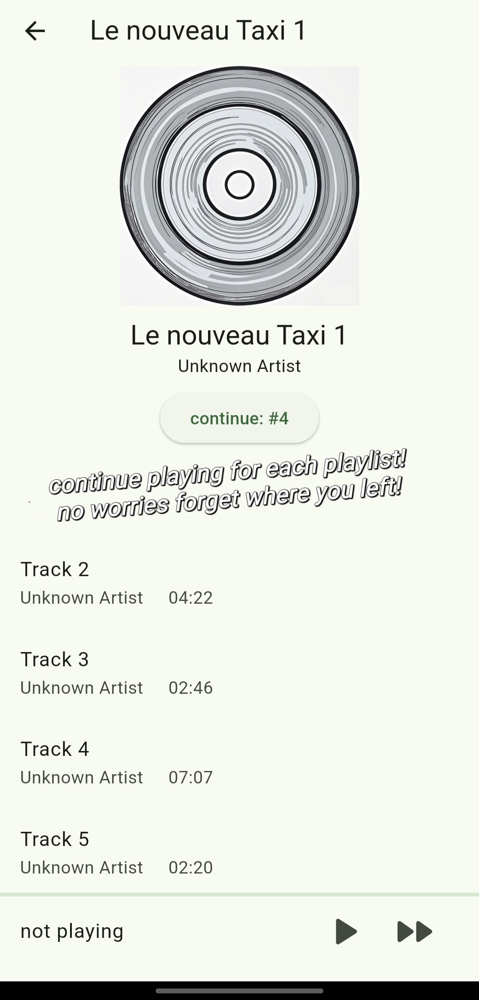
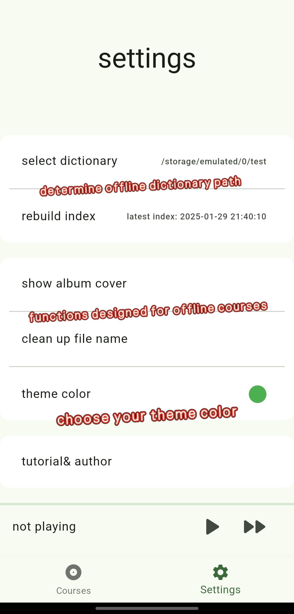
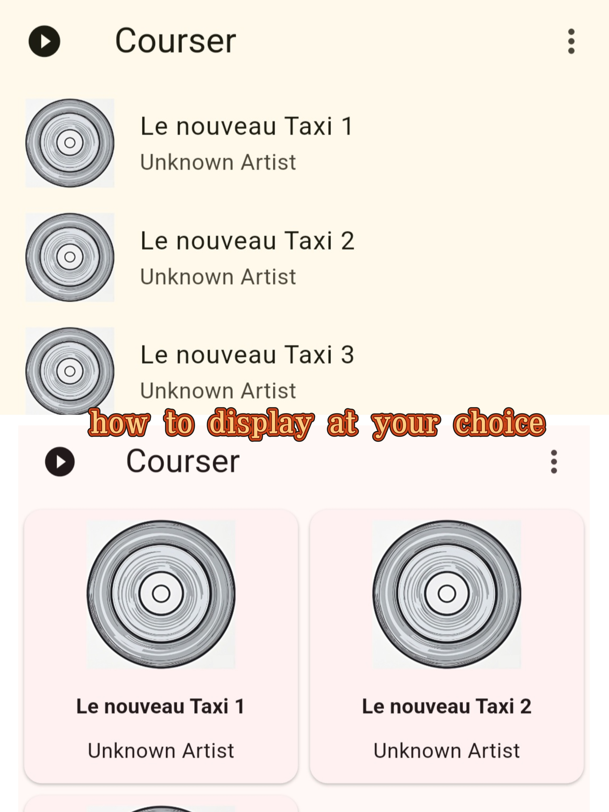
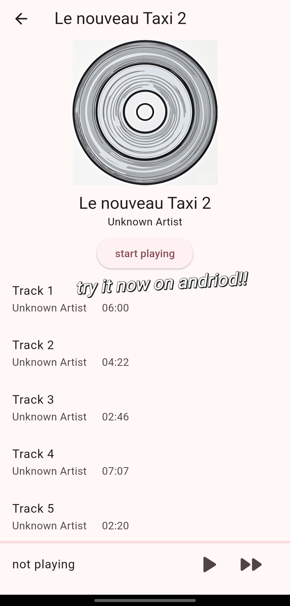

  

<h2 align="center">Lemon🍋‍🟩 - offline course player</h2>
A user-orientated audio player, specially designed for audiobook📖 and courses🎓. 

supported language: [CN](README_zh.md)& EN

# Features
- 🌟Determine playlist based on folder📂, not mp3 tags🏷️
- 🌟"continue playing" for each playlist⏩
- 🌟auto sort and clean file names✂️
- 🌟open-source, total-free💸

# Screen shots

  
  
  
  

# future goals
1. ⚡Autodetect pdf resource and show an icon beside, show pdf if clicked
2. 🎶support for all kinds of music formats
3. 🍬user determine how to sort, rename music
4. 🗂️auto-rebuild index, detecting folder change

# Known Issues
1. have error playing music while loading db

# other information
Developed by Blake Jia, built with flutter. 
